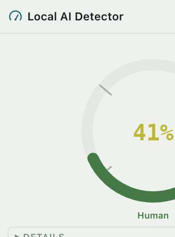
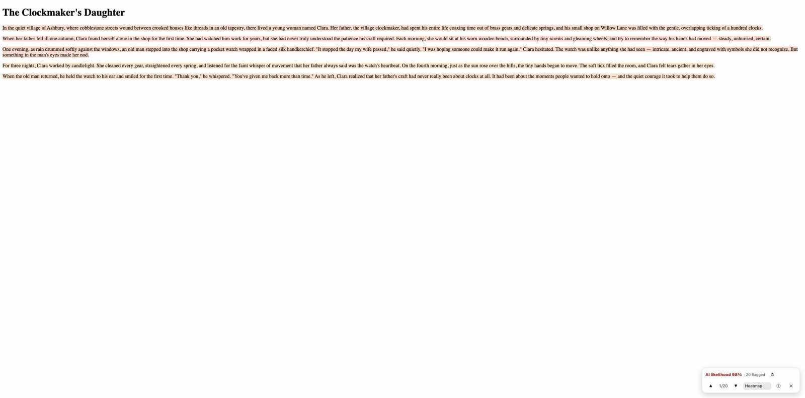
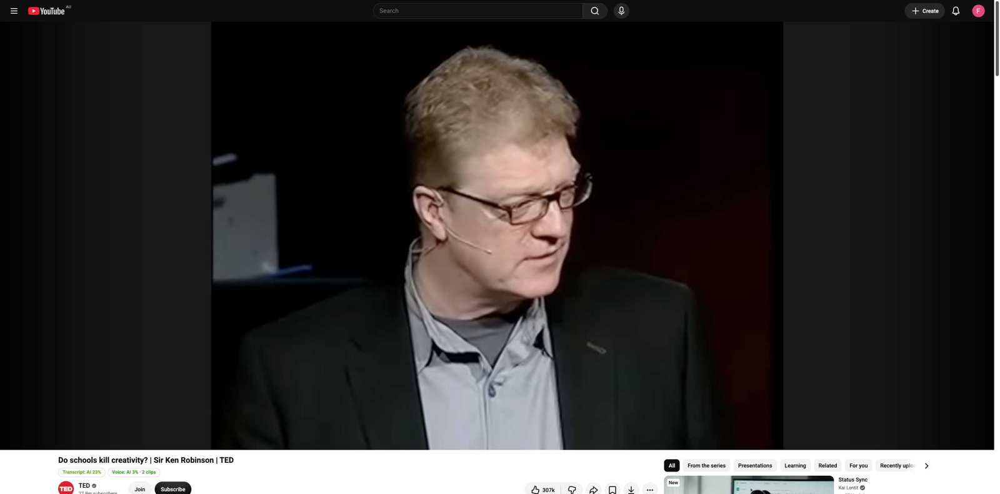
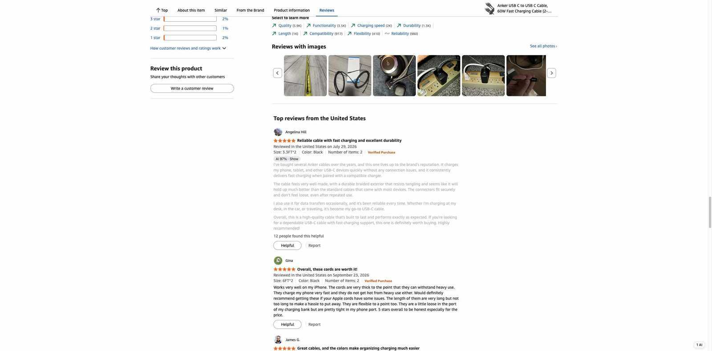
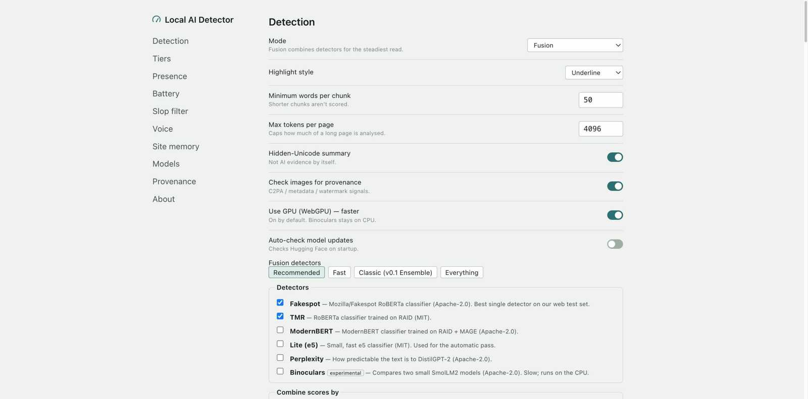
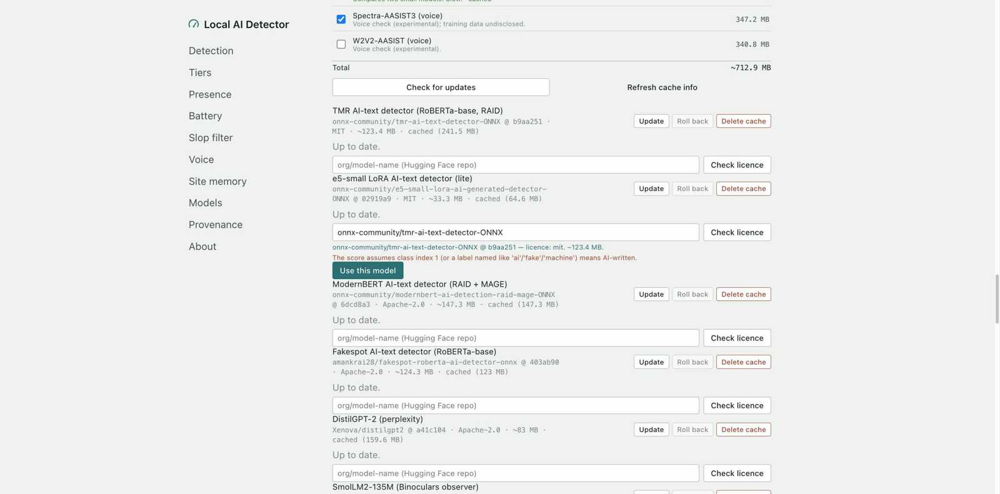
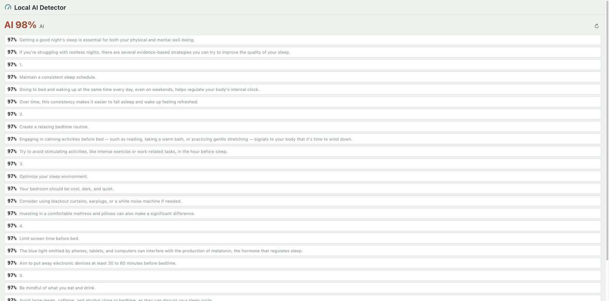
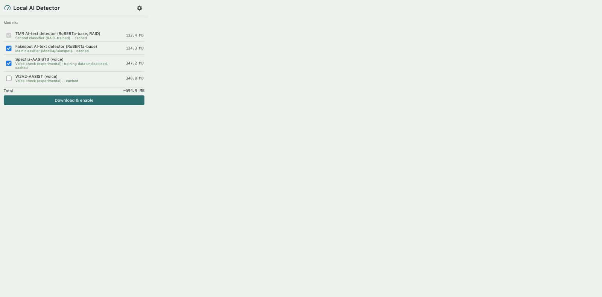

<div align="center">

# Local AI Detector

**Filter AI-generated content. Runs on your device.**
Free, open-source, fully local AI-content detector for Chrome and Firefox.
No servers, no API keys, no accounts, no telemetry. Every analysis — text
classification, perplexity, hidden-Unicode scanning, and image provenance
(C2PA / watermarks) — runs on-device, in the browser, using models you
download once from Hugging Face.

[Install](#install) · [Features](#features) · [How accurate is it?](#how-accurate-is-it) · [Privacy](#privacy) · [Build from source](#build-from-source) · [Contributing](#contributing) · [Licence](#licence)

</div>

## What it is

Local AI Detector adds a small status chip to the page you're reading and a
button in the toolbar. It:

- tells what kind of page you're on (article, thread, video, search, app)
  and scores it accordingly — a page score, a per-comment/per-reply score on
  threads and chat sites, or a snippet marker on search results;
- runs a cheap **Quick** check automatically, confirmed against the full
  **Fusion** detector set before showing anything past 70%, and offers a
  one-click **Deep** check that runs everything;
- on YouTube, also reads the transcript and, experimentally, samples the
  audio for likely synthetic narration;
- highlights the flagged sentences directly on the page;
- flags hidden/invisible Unicode characters in the text;
- checks images on the page for C2PA Content Credentials, generator
  metadata, and known open-source invisible watermarks.

Nothing leaves your machine except the one-time model download from Hugging
Face and, if you opt in per site, the bytes of an image you ask it to check.
See [Privacy](#privacy) for the exact, complete list of network requests.

|  |  |
|---|---|
|  |  |
| Popup: gauge and verdict (a Reddit comment, confirmed by Fusion) | The in-page pill and heatmap highlighting |
|  |  |
| YouTube: transcript + voice chips | Slop filter dimming a flagged review |
|  |  |
| Options: Fusion detectors | Model management: update, roll back, custom repo |
|  |  |
| Side panel: per-sentence report | First-run download checklist before any download |

These are from the release QA pass ([`docs/qa-results.md`](docs/qa-results.md),
[`docs/qa/shots/`](docs/qa/shots/)), the most recent and most accurate set.
Older feature screenshots, including Firefox, are in
[`docs/screenshots/`](docs/screenshots/).

## Features

### Page-type routing

Every page is classified as an article, a thread, a video, a subtitle file, a
search page, or an app (`src/content/pageType.ts`: URL rules for major sites,
then a fingerprint from structured data, OpenGraph, and the page's shape),
and only the check that suits it runs: page text on articles and threads,
transcript + voice on videos, timed scoring on subtitle files, snippet
markers on search, nothing automatic on apps. The popup shows the page type
quietly ("Page: video (YouTube)"), with a per-site override in Options →
Presence.

### Two tiers: Quick (automatic) and Deep (on demand)

- **Quick**: runs automatically, TMR alone (~0.4 s per 1,000 words on
  WebGPU). Any result at or above 50% is silently re-checked against the
  full Fusion set before anything is shown, which is what keeps ordinary
  human writing from flashing a high number. The chip only appears from
  70%.
- **Deep**: the ↻ button in the popup, pill, or side panel. Runs the full
  Fusion set plus ModernBERT, Binoculars and perplexity (on YouTube, also
  voice at the Thorough rate and the whole transcript). Replaces the Quick
  result and is labelled "Deep".
- Both the Quick and Deep detector sets, and whether Quick runs
  automatically at all, are configurable (Options → Tiers).

### YouTube: transcript and voice check (experimental)

On YouTube, the transcript is read through the player's own caption request
(bare caption URLs return nothing without it) and scored like page text,
shown as its own chip ("Transcript: AI 84%"); clicking a flagged segment
seeks the video. An experimental, **on-by-default** voice check samples
short clips of the actual audio (`captureStream`, never a separate fetch) to
flag likely synthetic narration — "Voice: AI 72% · 14 clips" — at a
configurable rate (Light/Normal/Thorough/Continuous) that's front-loaded for
a fast early read and drops to Light on battery. It catches clean,
AI-written scripts and clean/compressed TTS; it is not a substitute for a
provenance/watermark check, and can be turned off in Options → Voice.

### Threads, comments, and search results

On Reddit, Hacker News, forums, review sites and YouTube comments, each
comment/post/reply gets its own score (the chip shows a count, e.g. "3 AI");
articles show a single score. On ChatGPT, Claude, Gemini, Copilot and
Perplexity-style chat pages, only assistant replies are scored, never your
own prompt. Google/Bing/DuckDuckGo/Kagi results get a small marker on
flagged snippets, scored from the visible snippet text only — it never
fetches the linked page. An optional **slop filter** (off by default) dims
or collapses items at or above the filter threshold, each with a "Show"
button. An optional, local-only **site memory** keeps a per-domain tally
("7 of the last 10 pages scored high"); it stores only the hostname, a
high/low flag and a date — never text or URLs — and is fully clearable from
Options.

### Presence (Options → Presence)

How much the extension shows, by default **Status chip**: a small corner
label that stays quiet (hidden below a threshold, peekable on hover) and
expands into the full inspector on click. Other presets: **On click**
(nothing until you ask), **Badge** (toolbar % only), **Inspector** (today's
always-on highlights + pill), **Side panel** (Chrome `sidePanel` / Firefox
sidebar — a full report, click a flagged sentence to scroll to it, never
marks the page). Auto-run uses a fast model; the full mode you've configured
always runs on demand. Per-site rules ("never on this site") and a
battery-saver (Battery Status API / Compute Pressure where available, a
manual toggle where they're not) live in the same section.

### More entry points

Context menus to analyze the page, check an image for Content Credentials &
watermarks, or check the text in an input/textarea/contenteditable box; a
popup paste box and file drop (.txt/.md/.html/.docx, extracted locally); and
rebindable keyboard shortcuts (analyze page/selection, toggle visibility).

### Detector modes (Options → Mode)

| Mode | What it runs | Notes |
|---|---|---|
| **Fusion** (default; was "Ensemble") | Any mix of the detectors below, combined by weighted average (default), log-odds average, majority vote or max. Default set: **Fakespot + TMR** | Every result says how many detectors agree, and flags it when they split. Options → Fusion shows the download size and speed of your mix |
| **Classifier** | [`tmr-ai-text-detector`](https://huggingface.co/onnx-community/tmr-ai-text-detector-ONNX) (RoBERTa-base, RAID-trained, MIT) | ~250 MB (fp16, GPU) / ~130 MB (q8, CPU) |
| **Classifier-lite** | [`e5-small-lora-ai-generated-detector`](https://huggingface.co/onnx-community/e5-small-lora-ai-generated-detector-ONNX) (MIT) | ~35–70 MB, the weakest detector; selectable for the Quick tier but not the default |
| **Perplexity** | [`distilgpt2`](https://huggingface.co/Xenova/distilgpt2), lower perplexity ⇒ more AI-like | Classic GPTZero-style signal; weak on its own |
| **Binoculars** *(experimental)* | Two [`SmolLM2-135M`](https://huggingface.co/onnx-community/SmolLM2-135M-ONNX) models (base + instruct) | Cross-perplexity ratio; slow, CPU-only |

Fusion-only detectors: **Fakespot** ([`fakespot-ai/roberta-base-ai-text-detection-v1`](https://huggingface.co/fakespot-ai/roberta-base-ai-text-detection-v1),
Mozilla's RoBERTa detector, Apache-2.0, ~130 MB, CPU) — the best single detector on our web
test set — and **ModernBERT** ([RAID + MAGE](https://huggingface.co/onnx-community/modernbert-ai-detection-raid-mage-ONNX),
Apache-2.0, ~155 MB, CPU; weaker on today's models).

Runs on the GPU (WebGPU) by default, with a CPU (WASM) fallback that has its own
calibration. Fakespot, ModernBERT and Binoculars always use the CPU.

A hidden-Unicode scan (zero-width characters, tag characters, bidi controls,
etc.) always runs alongside whichever mode is selected, and is shown
separately as "unusual invisible characters" — **never** folded into the AI
score, since ordinary typography, CJK input methods, and copy-pasting from
Word or PDFs produce these too.

### Highlight styles (Options → Highlight style)

- **Heatmap** (default): every sentence is tinted by its own score.
- **Flagged-only**: only sentences at or above the flagged threshold are
  marked (Ctrl+F-style).
- **Underline**: a subtler wavy underline instead of a background tint.

All three use the CSS Custom Highlight API (no DOM mutation of the page's
text), with a `<mark>`-based fallback where it isn't available.

### Provenance and watermarks (images)

Every image the extension is allowed to check ([permission model](#privacy))
is run through, in order:

1. **C2PA / Content Credentials** — cryptographic signature and hash
   validation via [`@contentauth/c2pa-web`](https://github.com/contentauth/c2pa-js),
   with the signer checked against a bundled [C2PA Trust List](https://github.com/c2pa-org/conformance-public)
   (CC BY 4.0, attributed in [`THIRD_PARTY.md`](THIRD_PARTY.md)). No OCSP or
   remote manifest fetching — everything is checked offline.
2. **Unsigned generator metadata** — IPTC `DigitalSourceType`, Stable
   Diffusion WebUI/ComfyUI/InvokeAI parameters, NovelAI's stealth-alpha PNG
   metadata, Midjourney/China GB 45438-2025 labels, read with
   [ExifReader](https://github.com/mattiasw/ExifReader) plus a small PNG-chunk
   parser. Always labelled **"unsigned claim"**: plain text, trivially forged
   or stripped.
3. **Stable Diffusion / SDXL / FLUX invisible watermark** — our own
   from-scratch port of the `imwatermark` DWT-DCT decoder (a hit is a
   positive; a miss means nothing, since it doesn't survive resizing,
   cropping or rotation).
4. **Text: C2PA text manifests** — via [`c2pa-text`](https://github.com/encypherai/c2pa-text).

**Always shown as "cannot be checked locally"** (no key, no bundleable
detector, or a proprietary/rate-limited portal is the only checker):

- **Google SynthID** (image, video, audio, text) — also used by OpenAI
  (images/audio) and ElevenLabs (audio).
- **Anthropic's Claude text watermark** (SynthID-Text-style, keyed;
  detector is private preview only).
- **Gemini's text watermark** (SynthID-Text, Google's own key).
- **Meta Content Seal** (Muse Image).
- **Digimarc**, and **Adobe TrustMark**'s ID → manifest lookup (the ID
  decode is local, but resolving it to a verdict needs Adobe's remote API).
- Any keyed academic LLM watermark (Kirchenbauer/Aaronson-style) whose key
  isn't public.

The UI is explicit everywhere: **"no watermark found" is never shown as
"human-made"** — it means exactly what it says, nothing more. See
[`docs/watermarks.md`](docs/watermarks.md) for the full research and
per-provider survey behind this list.

### Model updates

Default models are pinned to an exact Hugging Face commit per release
(`src/engine/models.ts`). Options → "Check for updates" queries the HF API
for each model's latest commit and shows the new revision and its licence
before you update; the previous revision is kept until the new one loads
successfully, and rollback is one click. Auto-checking is **off by default**.
You can also point any model slot at a custom Hugging Face repo; its licence
is looked up and shown, with a warning for anything not on an open-licence
allowlist.

## How accurate is it?

**Short version: good at catching unedited, straight-out-of-the-box AI filler; easy
to fool on purpose; and tuned so it would rather let slop through than hide a real
person.** It isn't a forensic tool, and a score isn't proof.

The number you see ("AI 91%") is a **calibrated probability**. On our web test set,
about 91 of every 100 texts shown at 91% really were AI-generated. That assumes equal amounts of human and AI text. Where AI text is rarer, the real odds are lower.
Under 30 words there's too little text to say anything, so you'll see "—".

Measured in the extension itself, on the held-out half of about 1,900 web texts: Reddit
posts, Q&A answers, Amazon/Trustpilot reviews, news, how-to articles, short social posts,
stories and essays. The AI side comes from 2024–26 models (GPT-4o/4.1, o3, Gemini 2.x, Claude,
DeepSeek, Qwen, Llama, Mistral, …); the human side comes from the same sites. Full numbers are in
[`docs/calibration.md`](docs/calibration.md).

| | Tells AI from human (AUROC) | Human texts flagged | AI texts flagged | Slop filter: hidden items that were AI / AI caught |
|---|---|---|---|---|
| **Fusion (Deep, default: Fakespot + TMR)** | **0.91** | **5%** | **68%** | **99%** / 54% |
| TMR alone (Quick tier, before Fusion confirms) | 0.87 | 4% | 58% | 100% / 5% |

| Genre (default Fusion, AUROC) | Reviews | News | Stories | Essays | Social | Blog / how-to | Answers | Forum posts |
|---|---|---|---|---|---|---|---|---|
| | 0.98 | 0.92 | 0.94 | 0.93 | 0.94 | 0.90 | 0.87 | 0.81 |

An unedited assistant-voice story ("write me a short story about…") now shows about
**AI 95%**, against the "51%" someone reported on the old scale. Stories from OpenAI's own models were the
hardest group in the test set (a small sample: about 60% shown on average).

The live release QA pass ([`docs/qa-results.md`](docs/qa-results.md)) confirmed these numbers
hold up outside the eval set: a Reddit thread that used to show 95% now shows 41%, Wikipedia
82% → 34%, a TED talk transcript 53% → 23%, while fresh unedited AI text (story, review, forum
post, how-to answer) still shows 98%.

Known, deliberate weaknesses:

- **Paraphrasing and "humanizer" tools beat it**, as they beat every public
  detector ([RAID](https://arxiv.org/abs/2405.07940)). So does a person editing the text.
- **Forum posts are the hardest genre.** Casual Reddit-style AI posts slip through more
  often than reviews or news.
- **Casual, agentic ChatGPT replies read low.** Shared ChatGPT conversations tested live
  scored only 3–12% Quick / 21% Fusion / 28% Deep on genuinely AI-written replies — a
  real detector limitation on today's more casual ChatGPT voice, not a bug in how the
  extension reads the page (see [`docs/qa-results.md`](docs/qa-results.md), row A21).
- **Non-native English writing** scores higher on detectors like these (a well-known bias).
  English only.
- **Short text is noisy.** Comments under about 50 words get wider error bars, and single
  sentences are always scored together with their neighbours.
- Binoculars, ModernBERT-as-a-mode, and the voice check are experimental.

## Privacy

See [`PRIVACY.md`](PRIVACY.md) for the complete, precise list of every
network request the extension makes and when. In short: no analytics, no
accounts, no servers of ours — the only network access is downloading/
updating models from `huggingface.co`/`*.hf.co`, and fetching an image's
bytes only for a site you've explicitly allowed.

## Install

### From source (Chrome, Firefox, Edge, Brave — any Chromium or Gecko browser)

There is no published listing yet (see [`docs/release.md`](docs/release.md)
for the maintainer's publishing checklist). Until then, build and load it
yourself — see [`docs/install.md`](docs/install.md) for full details,
screenshots, and troubleshooting. Quick version:

```sh
git clone https://github.com/freddygaffey/ai_detector.git local-ai-detector
cd local-ai-detector
npm ci
npm run build            # -> .output/chrome-mv3
npm run build:firefox    # -> .output/firefox-mv3
```

**Chrome / Edge / Brave:** open `chrome://extensions`, enable *Developer
mode*, click *Load unpacked*, and select `.output/chrome-mv3`.

**Firefox:** open `about:debugging#/runtime/this-firefox`, click *Load
Temporary Add-on…*, and select any file inside `.output/firefox-mv3` (e.g.
`manifest.json`). Temporary add-ons are removed when Firefox restarts; see
[`docs/install.md`](docs/install.md) for how to load it permanently.

## Build from source

```sh
npm ci                  # installs deps; postinstall copies vendored WASM/licences
npm run dev              # Chrome, dev mode with HMR
npm run dev:firefox      # Firefox, dev mode
npm run build             # Chrome production build -> .output/chrome-mv3
npm run build:firefox     # Firefox production build -> .output/firefox-mv3
npm test                  # vitest (223+ unit tests)
npm run typecheck
npm run package            # full release build: typecheck, tests, both browsers,
                            # web-ext lint, chrome/firefox/sources zips, sha256,
                            # rebuild-determinism check -> release/
```

Node and npm versions are pinned in [`.nvmrc`](.nvmrc) and
`engines` in [`package.json`](package.json). See
[`BUILD_FROM_SOURCE.md`](BUILD_FROM_SOURCE.md) for the exact reproducible
build a reviewer (or you) would run from a release's source zip.

## Architecture

```
content script (extract visible text → sentences; render highlights, the
                floating pill, tooltips, image badges — Shadow DOM, no page
                CSS leakage)
   │  runtime messages (src/shared/messages.ts)
   ▼
background (Chrome: service worker · Firefox: event page)
   — routes messages, owns the toolbar badge and settings, orchestrates the
     one analysis path shared by the popup, the pill, and the context menu
   │
   ▼
inference host  (Chrome: an offscreen document · Firefox: a dedicated Worker
                 spawned from the event page)
   transformers.js 4.x + bundled onnxruntime-web WASM (public/ort/, wasmPaths
   pinned, never a CDN) — WebGPU by default, WASM fallback
                 also hosts C2PA validation (@contentauth/c2pa-web, its own
                 packaged worker/WASM under public/c2pa/)

popup: gauge, mode/style pickers, download consent + progress, per-site image
       permission button
options: all settings, model cache management (check/update/rollback/custom
         model + licence display), About/licences, WebGPU toggle
```

Every default model is pinned to an exact Hugging Face commit in
[`src/engine/models.ts`](src/engine/models.ts); the active `{repo, revision}`
per model slot comes from settings, so "Check for updates" and custom models
need no code change. Models are cached with the Cache API (IndexedDB
fallback). Full design rationale: [`docs/plan.md`](docs/plan.md) and
[`docs/feasibility.md`](docs/feasibility.md).

## Contributing

This is a small, honest side project, not a maintained product with SLAs —
but issues and pull requests are welcome, especially:

- calibration data (more languages, more generators, more genres of human
  writing — see [`docs/calibration.md`](docs/calibration.md) for the method);
- additional openly-licensed provenance/watermark schemes
  ([`docs/watermarks.md`](docs/watermarks.md) has the survey and the
  licence/feasibility bar new schemes need to clear);
- bug reports with a URL or a minimal reproduction, ideally with the
  Options → "engine info" line and browser/OS.

Before sending a PR: `npm run typecheck && npm test && npm run build &&
npm run build:firefox` should all pass, and `npm run package` should
succeed end-to-end if you're touching anything packaging-related. There's no
CI configured (see [`docs/release.md`](docs/release.md)), so please run
these locally.

## Licence

MIT — see [`LICENSE`](LICENSE). Third-party libraries, runtime-downloaded
models, and their licences are listed in full in
[`THIRD_PARTY.md`](THIRD_PARTY.md).
