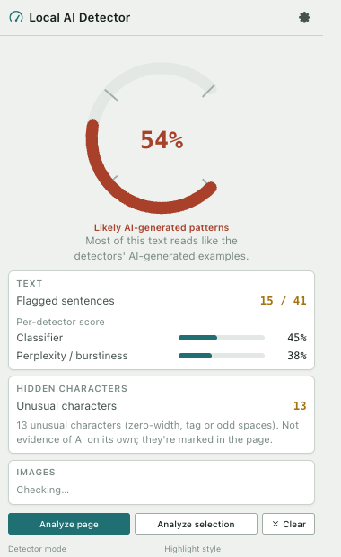
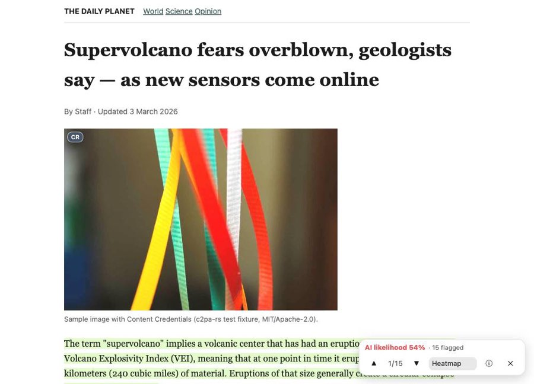
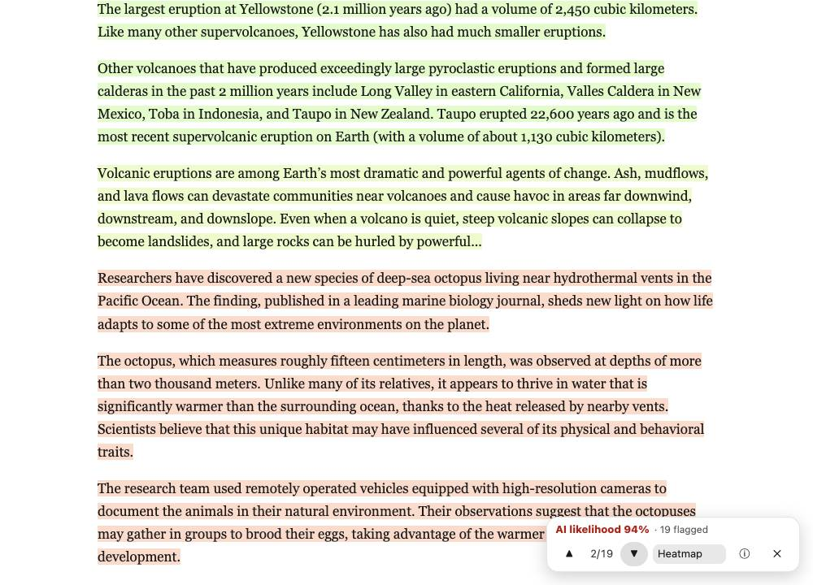
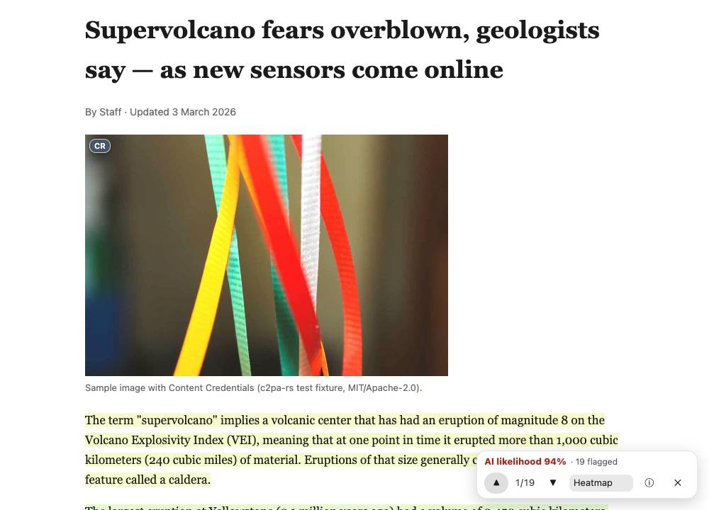
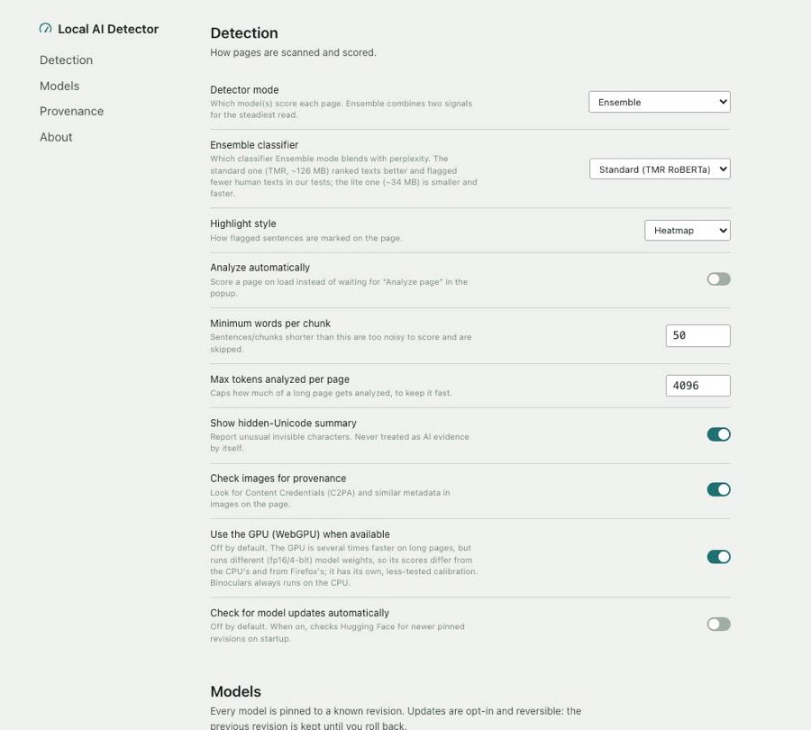
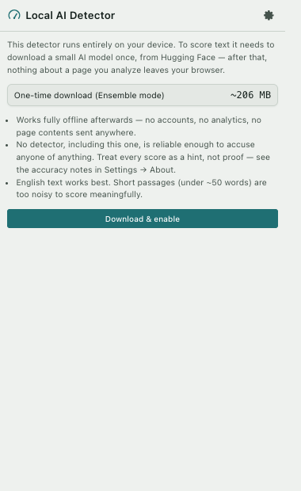

<div align="center">

# Local AI Detector

**A free, open-source, fully local AI-content detector for Chrome and Firefox.**
No servers, no API keys, no accounts, no telemetry. Every analysis — text
classification, perplexity, hidden-Unicode scanning, and image provenance
(C2PA / watermarks) — runs on-device, in the browser, using models you
download once from Hugging Face.

[Install](#install) · [Features](#features) · [How accurate is it?](#how-accurate-is-it) · [Privacy](#privacy) · [Build from source](#build-from-source) · [Contributing](#contributing) · [Licence](#licence)

</div>

## What it is

Local AI Detector adds a small pill to the page you're reading and a button
in the toolbar. Click it (or let it run automatically) and it:

- scores the visible text for AI-generated writing patterns, sentence by
  sentence, using an on-device classifier and/or a perplexity model;
- highlights the flagged sentences directly on the page;
- flags hidden/invisible Unicode characters in the text;
- checks images on the page for C2PA Content Credentials, generator
  metadata, and known open-source invisible watermarks.

Nothing leaves your machine except the one-time model download from Hugging
Face and, if you opt in per site, the bytes of an image you ask it to check.
See [Privacy](#privacy) for the exact, complete list of network requests.

|  |  |
|---|---|
|  |  |
| Popup: gauge, verdict, per-detector breakdown | Heatmap highlight style on the page |
|  |  |
| The in-page pill: ▲/▼ steps through flagged sentences | C2PA badge on an image with Content Credentials |
|  |  |
| Options: models, engine info, cache management | First-run consent before any download |

(More screenshots, including Firefox, are in [`docs/screenshots/`](docs/screenshots/).)

## Features

### Detector modes (Options → Mode)

| Mode | What it runs | Notes |
|---|---|---|
| **Ensemble** (default) | Classifier (70%) + Perplexity (30%), blended per sentence | Best ranking on held-out data (see [accuracy](#how-accurate-is-it)) |
| **Classifier** | [`tmr-ai-text-detector`](https://huggingface.co/onnx-community/tmr-ai-text-detector-ONNX) (RoBERTa-base, RAID-trained) | The ensemble's default classifier; ~126 MB |
| **Classifier-lite** | [`e5-small-lora-ai-generated-detector`](https://huggingface.co/onnx-community/e5-small-lora-ai-generated-detector-ONNX) | ~4× smaller/faster, selectable as the ensemble's classifier too (Options → "Ensemble classifier") |
| **Perplexity** | [`distilgpt2`](https://huggingface.co/Xenova/distilgpt2), lower perplexity ⇒ more AI-like | Classic GPTZero-style burstiness/perplexity signal |
| **Binoculars** *(experimental)* | Two [`SmolLM2-135M`](https://huggingface.co/onnx-community/SmolLM2-135M-ONNX) models (base + instruct) | Cross-perplexity ratio; least-tested mode, WASM-only |

A hidden-Unicode scan (zero-width characters, tag characters, bidi controls,
etc.) always runs alongside whichever mode is selected, and is shown
separately as "unusual invisible characters" — **never** folded into the AI
score, since ordinary typography, CJK input methods, and copy-pasting from
Word or PDFs produce these too.

### Highlight styles (Options → Highlight style)

- **Heatmap** (default): every sentence is tinted by its own score.
- **Flagged-only**: only sentences at or above the flagged threshold are
  marked (Ctrl+F-style).
- **Underline**: a subtler wavy underline instead of a background tint.

All three use the CSS Custom Highlight API (no DOM mutation of the page's
text), with a `<mark>`-based fallback where it isn't available.

### Provenance and watermarks (images)

Every image the extension is allowed to check ([permission model](#privacy))
is run through, in order:

1. **C2PA / Content Credentials** — cryptographic signature and hash
   validation via [`@contentauth/c2pa-web`](https://github.com/contentauth/c2pa-js),
   with the signer checked against a bundled [C2PA Trust List](https://github.com/c2pa-org/conformance-public)
   (CC BY 4.0, attributed in [`THIRD_PARTY.md`](THIRD_PARTY.md)). No OCSP or
   remote manifest fetching — everything is checked offline.
2. **Unsigned generator metadata** — IPTC `DigitalSourceType`, Stable
   Diffusion WebUI/ComfyUI/InvokeAI parameters, NovelAI's stealth-alpha PNG
   metadata, Midjourney/China GB 45438-2025 labels, read with
   [ExifReader](https://github.com/mattiasw/ExifReader) plus a small PNG-chunk
   parser. Always labelled **"unsigned claim"**: plain text, trivially forged
   or stripped.
3. **Stable Diffusion / SDXL / FLUX invisible watermark** — our own
   from-scratch port of the `imwatermark` DWT-DCT decoder (a hit is a
   positive; a miss means nothing, since it doesn't survive resizing,
   cropping or rotation).
4. **Text: C2PA text manifests** — via [`c2pa-text`](https://github.com/encypherai/c2pa-text).

**Always shown as "cannot be checked locally"** (no key, no bundleable
detector, or a proprietary/rate-limited portal is the only checker):

- **Google SynthID** (image, video, audio, text) — also used by OpenAI
  (images/audio) and ElevenLabs (audio).
- **Anthropic's Claude text watermark** (SynthID-Text-style, keyed;
  detector is private preview only).
- **Gemini's text watermark** (SynthID-Text, Google's own key).
- **Meta Content Seal** (Muse Image).
- **Digimarc**, and **Adobe TrustMark**'s ID → manifest lookup (the ID
  decode is local, but resolving it to a verdict needs Adobe's remote API).
- Any keyed academic LLM watermark (Kirchenbauer/Aaronson-style) whose key
  isn't public.

The UI is explicit everywhere: **"no watermark found" is never shown as
"human-made"** — it means exactly what it says, nothing more. See
[`docs/watermarks.md`](docs/watermarks.md) for the full research and
per-provider survey behind this list.

### Model updates

Default models are pinned to an exact Hugging Face commit per release
(`src/engine/models.ts`). Options → "Check for updates" queries the HF API
for each model's latest commit and shows the new revision and its licence
before you update; the previous revision is kept until the new one loads
successfully, and rollback is one click. Auto-checking is **off by default**.
You can also point any model slot at a custom Hugging Face repo; its licence
is looked up and shown, with a warning for anything not on an open-licence
allowlist.

## How accurate is it?

**Short version: treat every score as a probability, not a proof, and expect
it to miss things.** This is a hobby-scale, honestly-documented detector, not
a forensic tool, and it was never meant to be one — see
[`docs/plan.md`](docs/plan.md): "Accuracy is **not** the goal. The goals are
open licences, privacy, and honest UI."

The scale: each detector's 0.5 is calibrated so that only about **5% of
human-written text scores that high or higher** — a deliberately
conservative operating point, because we'd rather miss AI text than falsely
accuse a person. A page scoring 50% means *"scored higher than ~95% of the
human texts we tested it against,"* not *"there's a 50% chance this is AI."*

Measured on 595 held-out texts from the [MAGE](https://huggingface.co/datasets/yaful/MAGE)
benchmark (Apache-2.0; not used to train either classifier), running in the
extension itself (Chrome, WASM):

| Detector | AUROC | False-positive rate | True-positive rate (catches) |
|---|---|---|---|
| Classifier (TMR) | 0.91 | 2% | 68% |
| Classifier-lite | 0.84 | 6% | 37% |
| Perplexity | 0.69 | 5% | 26% |
| **Ensemble (default)** | **0.92** | **1%** | **46%** |

In plain terms: at the default settings, the ensemble almost never wrongly
flags human writing (about 1 in 100), but it **misses roughly half of the AI
text** in this benchmark. On our own small 49-text calibration set, it also
flagged 3 of 28 human texts — all modern, plain US-government prose, the
hardest case for every detector tested.

Known, deliberate weaknesses (see [`docs/calibration.md`](docs/calibration.md)
for the full breakdown and methodology):

- **Paraphrasing defeats it.** Any tool or human edit that rewrites AI text
  will mostly slip through; this is a documented weakness of every public
  detector, not specific to this one ([RAID](https://arxiv.org/abs/2405.07940)).
- **Non-native English writing scores higher on perplexity-style detectors**
  (a well-known bias in the literature). English-only; not calibrated for
  other languages.
- **Plain, formulaic modern prose (legal, government, some technical
  writing) is the hardest case** for every detector here, human or not.
- **The calibration data is small and imperfect**: 49 hand-picked texts plus
  595 MAGE texts, one language, a handful of model families. Don't read the
  numbers above as a general accuracy claim beyond this benchmark.
- **Short text is noisy.** Sentences below the minimum word count are folded
  into their neighbours; treat single-sentence highlights as a relative heat
  map, not a verdict.
- Binoculars mode is explicitly experimental and least-tested.

## Privacy

See [`PRIVACY.md`](PRIVACY.md) for the complete, precise list of every
network request the extension makes and when. In short: no analytics, no
accounts, no servers of ours — the only network access is downloading/
updating models from `huggingface.co`/`*.hf.co`, and fetching an image's
bytes only for a site you've explicitly allowed.

## Install

### From source (Chrome, Firefox, Edge, Brave — any Chromium or Gecko browser)

There is no published listing yet (see [`docs/release.md`](docs/release.md)
for the maintainer's publishing checklist). Until then, build and load it
yourself — see [`docs/install.md`](docs/install.md) for full details,
screenshots, and troubleshooting. Quick version:

```sh
git clone https://github.com/freddygaffey/ai_detector.git local-ai-detector
cd local-ai-detector
npm ci
npm run build            # -> .output/chrome-mv3
npm run build:firefox    # -> .output/firefox-mv3
```

**Chrome / Edge / Brave:** open `chrome://extensions`, enable *Developer
mode*, click *Load unpacked*, and select `.output/chrome-mv3`.

**Firefox:** open `about:debugging#/runtime/this-firefox`, click *Load
Temporary Add-on…*, and select any file inside `.output/firefox-mv3` (e.g.
`manifest.json`). Temporary add-ons are removed when Firefox restarts; see
[`docs/install.md`](docs/install.md) for how to load it permanently.

## Build from source

```sh
npm ci                  # installs deps; postinstall copies vendored WASM/licences
npm run dev              # Chrome, dev mode with HMR
npm run dev:firefox      # Firefox, dev mode
npm run build             # Chrome production build -> .output/chrome-mv3
npm run build:firefox     # Firefox production build -> .output/firefox-mv3
npm test                  # vitest (223+ unit tests)
npm run typecheck
npm run package            # full release build: typecheck, tests, both browsers,
                            # web-ext lint, chrome/firefox/sources zips, sha256,
                            # rebuild-determinism check -> release/
```

Node and npm versions are pinned in [`.nvmrc`](.nvmrc) and
`engines` in [`package.json`](package.json). See
[`BUILD_FROM_SOURCE.md`](BUILD_FROM_SOURCE.md) for the exact reproducible
build a reviewer (or you) would run from a release's source zip.

## Architecture

```
content script (extract visible text → sentences; render highlights, the
                floating pill, tooltips, image badges — Shadow DOM, no page
                CSS leakage)
   │  runtime messages (src/shared/messages.ts)
   ▼
background (Chrome: service worker · Firefox: event page)
   — routes messages, owns the toolbar badge and settings, orchestrates the
     one analysis path shared by the popup, the pill, and the context menu
   │
   ▼
inference host  (Chrome: an offscreen document · Firefox: a dedicated Worker
                 spawned from the event page)
   transformers.js 4.x + bundled onnxruntime-web WASM (public/ort/, wasmPaths
   pinned, never a CDN) — WebGPU if opted in, otherwise WASM
                 also hosts C2PA validation (@contentauth/c2pa-web, its own
                 packaged worker/WASM under public/c2pa/)

popup: gauge, mode/style pickers, download consent + progress, per-site image
       permission button
options: all settings, model cache management (check/update/rollback/custom
         model + licence display), About/licences, WebGPU toggle
```

Every default model is pinned to an exact Hugging Face commit in
[`src/engine/models.ts`](src/engine/models.ts); the active `{repo, revision}`
per model slot comes from settings, so "Check for updates" and custom models
need no code change. Models are cached with the Cache API (IndexedDB
fallback). Full design rationale: [`docs/plan.md`](docs/plan.md) and
[`docs/feasibility.md`](docs/feasibility.md).

## Contributing

This is a small, honest side project, not a maintained product with SLAs —
but issues and pull requests are welcome, especially:

- calibration data (more languages, more generators, more genres of human
  writing — see [`docs/calibration.md`](docs/calibration.md) for the method);
- additional openly-licensed provenance/watermark schemes
  ([`docs/watermarks.md`](docs/watermarks.md) has the survey and the
  licence/feasibility bar new schemes need to clear);
- bug reports with a URL or a minimal reproduction, ideally with the
  Options → "engine info" line and browser/OS.

Before sending a PR: `npm run typecheck && npm test && npm run build &&
npm run build:firefox` should all pass, and `npm run package` should
succeed end-to-end if you're touching anything packaging-related. There's no
CI configured (see [`docs/release.md`](docs/release.md)), so please run
these locally.

## Licence

MIT — see [`LICENSE`](LICENSE). Third-party libraries, runtime-downloaded
models, and their licences are listed in full in
[`THIRD_PARTY.md`](THIRD_PARTY.md).
