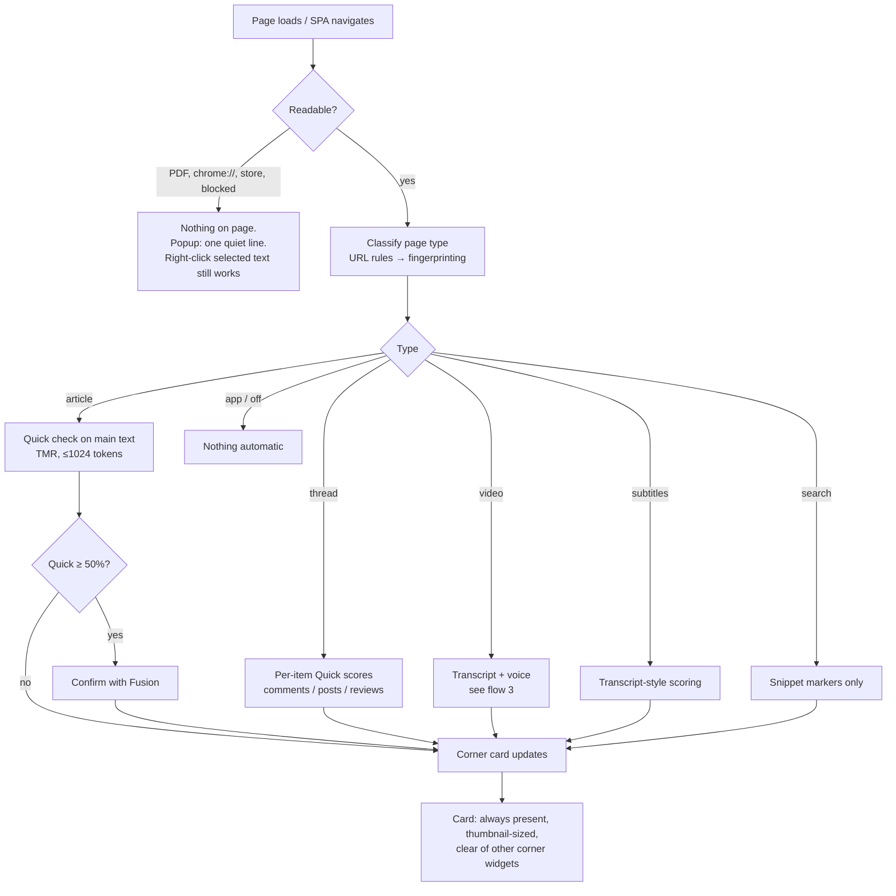
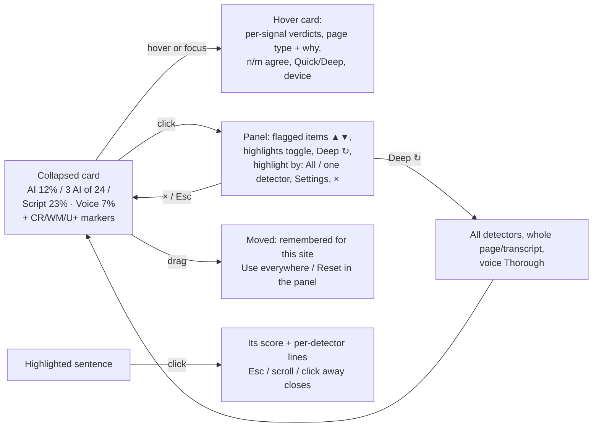
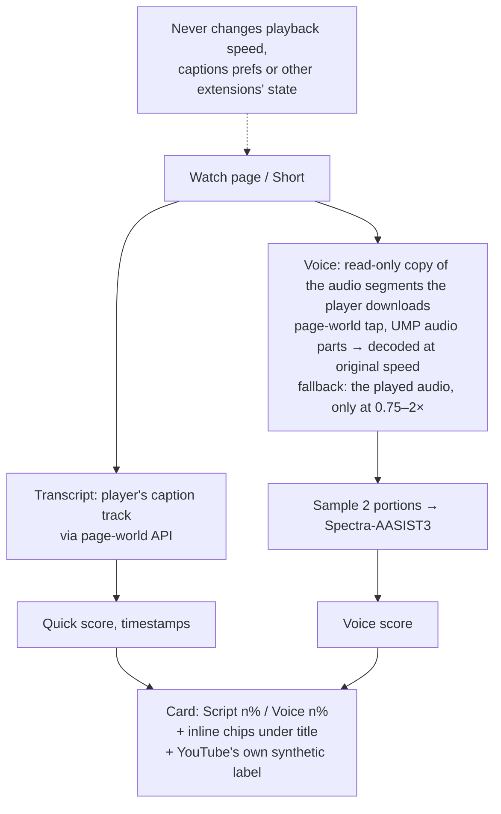
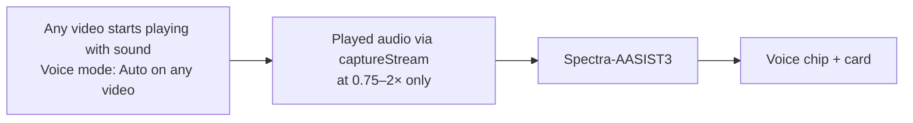
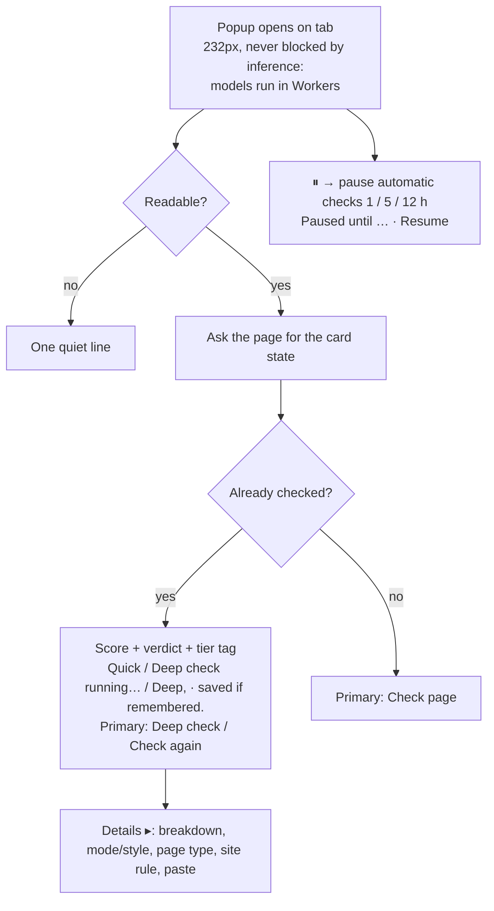
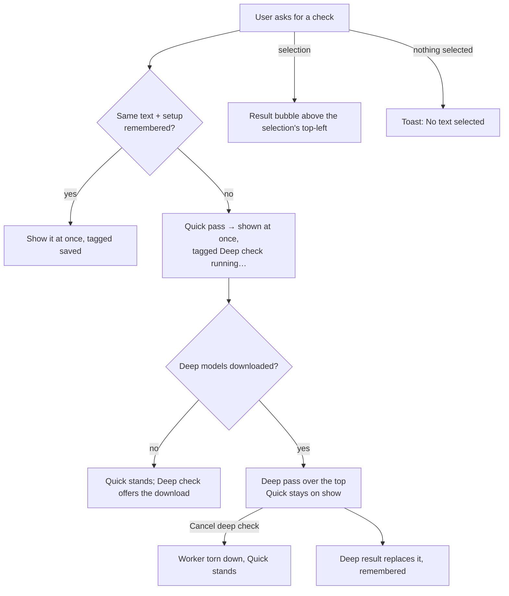
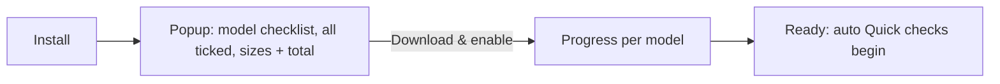

# Intended workflows

What the extension is supposed to do, as flows. Every change is checked against these, and the
daily-driver tour (docs/daily-driver-tour.md) exercises each one. If behaviour and diagram
disagree, one of them is a bug.

## 1. Any page loads

## 2. Corner card interaction

## 3. Video (YouTube)

### Other sites' videos

## 4. Popup opens

## 4b. Manual check (popup, context menu, shortcut)

## 5. First run

